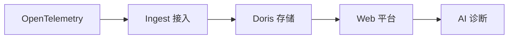

<p align="center">
  <a href="README.md">中文</a>
  &nbsp;|&nbsp;
  <a href="README_en.md">English</a>
</p>

# DataBuff 文档

国产开源 AI 原生 OpenTelemetry APM。

先做标准、可靠、易部署的 APM 后端，再把 AI 放进真实排障路径。

## 快速开始

```bash
curl -fsSL https://databuff.ai/databuff/ai-apm-install.sh | bash
```

安装平台，再安装 Demo，就能看到 Trace、指标、拓扑和 AI 诊断。

在线文档：[databuff.ai/docs](https://databuff.ai/docs/zh/)

## 文档目录

### 了解产品

- [产品介绍](产品介绍.md)
- [Roadmap](Roadmap.md)

### 快速入门

- [OpenTelemetry OTLP 接入](opentelemetry-otlp-ingestion.md)
- [Spring Boot OTLP 接入](快速入门/spring-boot-otlp-integration.md)
- [Python OTLP 接入](快速入门/python-otlp-integration.md)
- [Docker 安装部署](快速入门/docker安装部署.md)
- [K8s 安装部署](快速入门/k8s安装部署.md)

### 使用手册

- [告警](使用手册/告警.md)（安装后建议优先阅读）
- [应用性能](使用手册/应用性能.md)
- [AI 平台](使用手册/AI平台.md)
- [Agent 集成](使用手册/Agent集成.md)
- [SkyWalking 接入](使用手册/SkyWalking接入.md)
- [eBPF 接入](使用手册/eBPF接入.md)
- [Nginx 接入](使用手册/Nginx接入.md)
- [自定义数字专家](使用手册/自定义数字专家.md)
- [外部 MCP 集成](使用手册/外部MCP集成.md)

### 运维参考

- [Docker 运维](运维参考/Docker运维.md)
- [Kubernetes 运维](运维参考/K8s运维.md)
- [参数配置](运维参考/参数配置.md)
- [性能优化与容量规划](运维参考/性能优化.md)
- [平台自监控与自排障](运维参考/平台自监控与自排障.md)
- [平台自监控指标清单](运维参考/自监控指标清单.md)
- [升级与卸载](运维参考/升级与卸载.md)
- [离线安装](运维参考/离线安装.md)

### 架构设计

- [遥测数据流与存储](架构设计/遥测数据流.md)
- [AI 平台](架构设计/AI平台.md)
- [应用性能](架构设计/应用性能.md)
- [告警](架构设计/告警.md)
- [日志分析](架构设计/日志分析.md)

### 业界对比

- [DataBuff vs SkyWalking](业界对比/vs-skywalking.md)
- [DataBuff vs Jaeger](业界对比/vs-jaeger.md)
- [DataBuff vs SigNoz](业界对比/vs-signoz.md)

### 迁移指南

- [从 SkyWalking 迁移](迁移指南/from-skywalking-to-databuff.md)
- [从 Jaeger 迁移](迁移指南/from-jaeger-to-databuff.md)
- [从 Pinpoint 迁移](迁移指南/from-pinpoint-to-databuff.md)
- [从 SigNoz 迁移](迁移指南/from-signoz-to-databuff.md)
- [从 OpenObserve 迁移](迁移指南/from-openobserve-to-databuff.md)

## 核心链路


