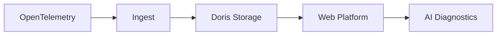

<p align="center">
  <a href="README.md">中文</a>
  &nbsp;|&nbsp;
  <a href="README_en.md">English</a>
</p>

# DataBuff Documentation

Open-source AI-native OpenTelemetry APM.

Build a standard, reliable, easy-to-deploy APM backend first, then put AI into real troubleshooting workflows.

## Quick Start

```bash
curl -fsSL https://databuff.ai/databuff/ai-apm-install.sh | bash
```

Install the platform, then install the Demo app to see traces, metrics, topology, and AI diagnostics.

Online docs: [databuff.ai/docs](https://databuff.ai/docs/en/)

## Documentation Index

### Product Overview

- [Product Overview](产品介绍_en.md)
- [Roadmap](Roadmap_en.md)

### Getting Started

- [OpenTelemetry OTLP Ingestion](opentelemetry-otlp-ingestion_en.md)
- [Spring Boot OTLP Integration](快速入门/spring-boot-otlp-integration_en.md)
- [Python OTLP Integration](快速入门/python-otlp-integration_en.md)
- [Docker Installation](快速入门/docker安装部署_en.md)
- [Kubernetes Installation](快速入门/k8s安装部署_en.md)

### User Guide

- [Alerting](使用手册/告警_en.md) (recommended after install)
- [Application Performance](使用手册/应用性能_en.md)
- [AI Platform](使用手册/AI平台_en.md)
- [Agent Integration](使用手册/Agent集成_en.md)
- [SkyWalking Ingestion](使用手册/SkyWalking接入_en.md)
- [eBPF Ingestion](使用手册/eBPF接入_en.md)
- [Nginx Ingestion](使用手册/Nginx接入_en.md)
- [Custom Digital Experts](使用手册/自定义数字专家_en.md)
- [External MCP Integration](使用手册/外部MCP集成_en.md)

### Operations

- [Docker Operations](运维参考/Docker运维_en.md)
- [Kubernetes Operations](运维参考/K8s运维_en.md)
- [Parameter Configuration](运维参考/参数配置_en.md)
- [Performance Tuning and Capacity](运维参考/性能优化_en.md)
- [Platform Self-Monitoring and Self-Troubleshooting](运维参考/平台自监控与自排障_en.md)
- [Platform Self-Monitoring Metric Catalog](运维参考/自监控指标清单_en.md)
- [Upgrade and Uninstall](运维参考/升级与卸载_en.md)
- [Offline Installation](运维参考/离线安装_en.md)

### Architecture

- [Telemetry Pipeline and Storage](架构设计/遥测数据流_en.md)
- [AI Platform](架构设计/AI平台_en.md)
- [Application Performance](架构设计/应用性能_en.md)
- [Alerting](架构设计/告警_en.md)
- [Log Analytics](架构设计/日志分析_en.md)

### Comparisons

- [DataBuff vs SkyWalking](业界对比/vs-skywalking_en.md)
- [DataBuff vs Jaeger](业界对比/vs-jaeger_en.md)
- [DataBuff vs SigNoz](业界对比/vs-signoz_en.md)

### Migration

- [From SkyWalking](迁移指南/from-skywalking-to-databuff_en.md)
- [From Jaeger](迁移指南/from-jaeger-to-databuff_en.md)
- [From Pinpoint](迁移指南/from-pinpoint-to-databuff_en.md)
- [From SigNoz](迁移指南/from-signoz-to-databuff_en.md)
- [From OpenObserve](迁移指南/from-openobserve-to-databuff_en.md)

## Core Pipeline


